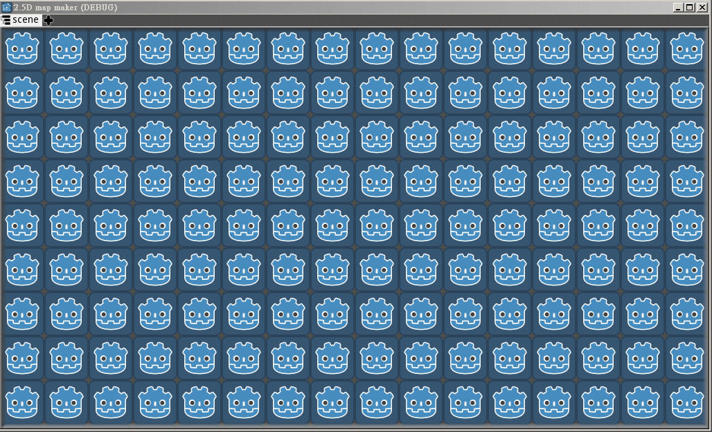

# BlenderWnd
 Godot plugin. Like Blender child window, user to set child window layout.
 
Need myTheme plugin, easyButton plugin, scrollBoxContainer plugin, transitionAnimation plugin.

# Screenshot

# Document
[Chinese document link](https://shimo.im/docs/hdqq9yVjWCj9QVh8/)

# Installing
[Installing plugins link](https://docs.godotengine.org/en/stable/tutorials/plugins/editor/installing_plugins.html)
